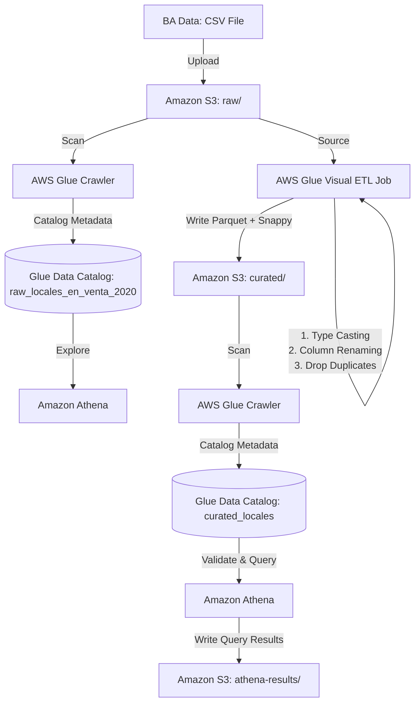
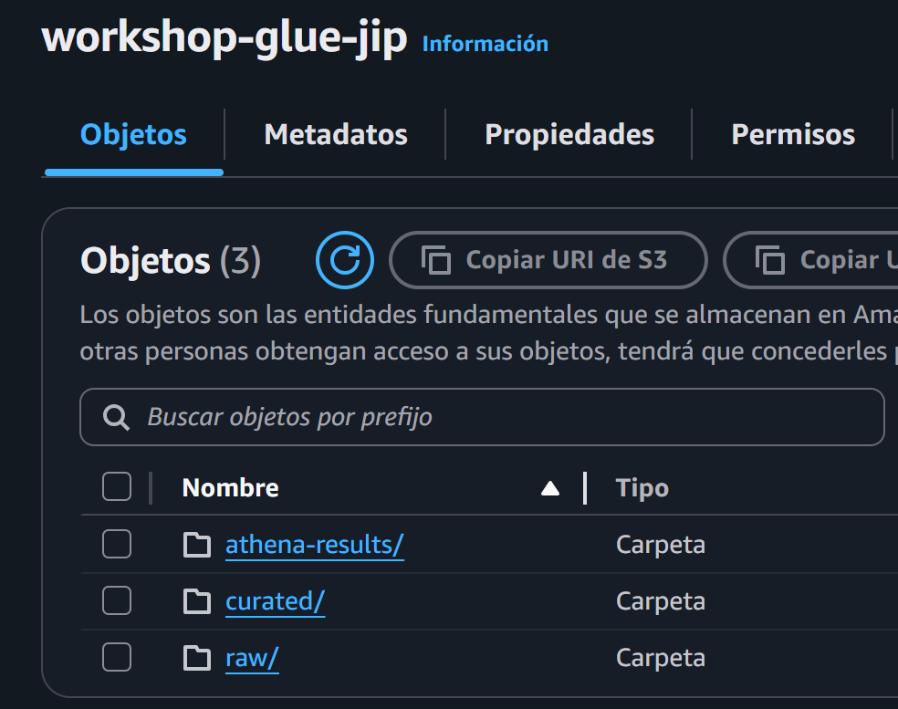
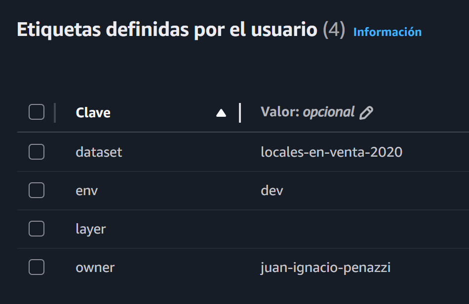
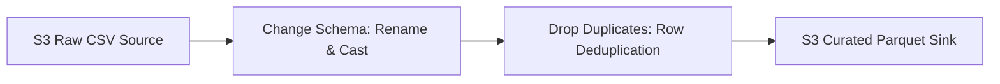
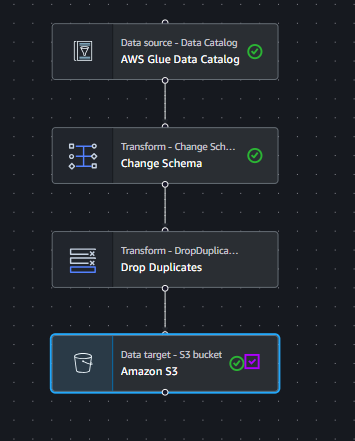
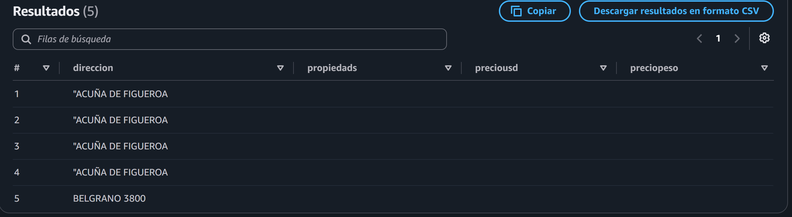
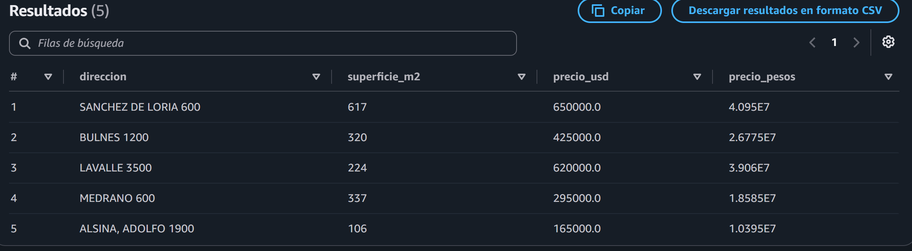
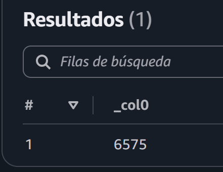
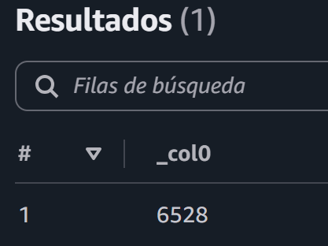

# AWS Glue ETL Pipeline Workshop Report
**Project Deliverable: End-to-End Property Sales Data Pipeline**

* **Author:** Juan Ignacio Penazzi
* **Date:** July 2026
* **Goals:**
   1. **Pipeline End-to-End:** Build an end-to-end data pipeline — ingest a dataset into a data lake, catalog its schema automatically, transform it into a business-ready `curated` layer, validate the results using SQL queries, and document the workflow in English so that other teams can understand and reproduce it.
   2. **AWS Services:** Learn and apply in practical solutions **Amazon S3**, **AWS Glue Data Catalog**, **Glue Crawlers**, **Glue ETL Jobs**, and **Amazon Athena**.

---

## 1. Overview

This report details the implementation of an end-to-end serverless data pipeline designed to ingest, catalog, transform, and validate real estate data from Buenos Aires. The pipeline ingests raw survey data of commercial properties listed for sale in 2020, automatically discovers its schema, resolves parsing anomalies caused by format issues, drops duplicate entries, and writes optimized, partitioned parquet datasets. The resulting curated layer is fully validated and made available for low-cost, high-performance analytical queries using Amazon Athena.

---

## 2. Architecture

The pipeline uses a decoupled, serverless architecture that separates compute and storage, ensuring scalability and minimal maintenance overhead.



### AWS Services Workflow
1. **Amazon S3 (Data Lake Storage):** Acts as the centralized storage divided into three logical layers:
   * `s3://workshop-glue-jip/raw/`: Landing zone for the immutable source CSV file.
   * `s3://workshop-glue-jip/curated/`: Storage zone for the cleaned, typed, and partitioned Parquet files.
   * `s3://workshop-glue-jip/athena-results/`: Output directory for queries executed in Amazon Athena.
2. **AWS Glue Crawler (Schema Discovery):** Crawls the S3 paths to automatically infer schemas, columns, and data types, registering them as metadata tables in the Data Catalog.
3. **AWS Glue Data Catalog (Metadata Registry):** Serves as a centralized, Hive-compatible metastore containing schema definitions for both the raw and curated data.
4. **AWS Glue Studio (Visual ETL Job):** Executes a Spark-backed ETL workflow to clean, rename, cast, and deduplicate records, transitioning the dataset from raw CSV to optimized Parquet.
5. **Amazon Athena (Serverless SQL Querying):** Used as the query engine to perform initial data profiling on the raw layer and final quality audits on the curated layer.

### Resource Tagging Policy
To ensure governance and cost tracking, all resources in this pipeline are tagged with the following metadata:
* **`env`**: `dev`
* **`owner`**: `juan-ignacio-penazzi`
* **`dataset`**: `locales-en-venta-2020`
* **`layer`**: `raw | curated | analytics | athena`

<p align="center">
  
  
</p>


---

## 3. Data Sources

* **Source Portal:** Buenos Aires Data (BA Data - Government Open Data Portal)
* **Dataset Name:** *Relevamiento muestral de los avisos publicados para la venta de locales en el año 2020. Se detalla el valor de publicacion, metros cuadrados, antiguedad, cantidad de ambientes, ubicacion, etc.*
* **Original File:** `locales-en-venta-2020.csv`
* **Download URL:** [BA Data - Locales en venta 2020](https://data.buenosaires.gob.ar/dataset/locales-en-venta/resource/ddfd0b3c-0068-45ff-92d1-c0c59a083e6b)
* **Size:** ~600 KB
* **Record Count:** 6,575 records (excluding header)
* **Format:** CSV (comma-separated, values containing quotes around numeric metrics)

---

## 4. Data Dictionary (Curated Layer)

Below is the structured data dictionary of the **Curated Layer** outputted in Parquet format. Column names have been cleaned to match standard business naming conventions, and data types have been corrected.

| Field | Type | Description |
| :--- | :--- | :--- |
| `direccion` | `string` | The street address of the commercial property (e.g., "ACUÑA DE FIGUEROA, FRANCISCO 1000"). |
| `superficie_m2` | `int` | Covered floor area of the property in square meters (originally `propiedads`). |
| `precio_usd` | `double` | Advertised price in US Dollars (USD). |
| `precio_pesos` | `double` | Advertised price in Argentine Pesos (ARS). |
| `usd_m2` | `double` | Calculated price in USD per square meter. |
| `pesos_m2` | `double` | Calculated price in ARS per square meter. |
| `antiguedad` | `int` | The age of the property building in years (originally `antig`). |
| `en_galeria` | `string` | Binary flag representing if the shop is inside a shopping gallery ("SI" or "NO"). |
| `cotizacion` | `double` | USD to ARS exchange rate used at the time of publication (originally `cotiz_`). |
| `trimestre` | `string` | The calendar quarter of 2020 when the notice was active (originally `trimestre_`). |
| `barrio` | `string` | The neighborhood of Buenos Aires where the property is situated (originally `barrios_`). |
| `comuna` | `int` | Commune identifier number representing the administrative zone (originally `comuna_`). |
| **`year`** *(Partition)* | `string` | Partition column representing the directory layout year (e.g., `2026`). |
| **`month`** *(Partition)* | `string` | Partition column representing the directory layout month (e.g., `07`). |
| **`day`** *(Partition)* | `string` | Partition column representing the directory layout year (e.g., `08`). |
---

## 5. Transformations

The AWS Glue Visual ETL Job performs four major operations to transform raw CSV data into a high-quality curated dataset:



1. **Schema Mapping & Column Renaming:**
   Standardized column names to descriptive `snake_case` formats for business analysts:
   * `propiedads` $\rightarrow$ `superficie_m2`
   * `antig` $\rightarrow$ `antiguedad`
   * `cotiz_` $\rightarrow$ `cotizacion`
   * `trimestre_` $\rightarrow$ `trimestre`
   * `barrios_` $\rightarrow$ `barrio`
   * `comuna_` $\rightarrow$ `comuna`

2. **Type Casting & Quote Stripping:**
   Corrected numerical columns that were enclosed in double quotes in the source CSV (e.g., `"87000"`).
   * Casted `preciousd`, `preciopeso`, `usdm2`, `pesosm2`, and `cotiz_` (now `cotizacion`) from String/BigInt to `double`.
   * Casted `propiedads` (now `superficie_m2`), `antig` (now `antiguedad`), and `comuna_` (now `comuna`) to `int`.

3. **Row Deduplication (Drop Duplicates):**
   * Configured a "Drop Duplicates" node matching across all row columns (`Match entire rows`) to purge redundant entries and clean the dataset.

4. **Optimized Storage Writer (Parquet + Snappy + Partitioning):**
   * Configured S3 curated target to write in **Apache Parquet**, a columnar format optimized for analytics.
   * Utilized **Snappy** compression to minimize storage size.
   * Partitioned the output by directory (e.g., `year=2026/`) to enable partition pruning in downstream SQL engines.

<p align="center">
   
</p>

---

## 6. Validation

### 1. The Raw Schema Parser Issue (Schema-on-Read Defect)
During initial exploration in Amazon Athena, a critical data loading issue was identified. The source CSV dataset enclosed numerical values in double quotes (e.g., `"87000"`). The raw crawler inferred these columns as `bigint`. Because the standard Athena CSV parser did not strip these quotes, it failed to parse them as integers and silently loaded all numeric fields as `null`.

**Raw Athena Query (Failing Schema-on-Read):**
```sql
SELECT 
    direccion, 
    propiedads, 
    preciousd, 
    preciopeso 
FROM raw_locales_en_venta
LIMIT 5;
```

**Query Results:**


<p align="center">
   
</p>

### 2. Curated Layer Verification (After ETL Job)
After executing the Glue Visual ETL Job (which casted the types correctly), the curated table was queried in Athena. Numeric values were successfully parsed, displaying the expected results.

**Curated Athena Query:**
```sql
SELECT 
    direccion, 
    superficie_m2, 
    precio_usd, 
    precio_peso 
FROM curated_locales_en_venta
LIMIT 5;
```

**Query Results:**


<p align="center">
   
</p>

### 3. Deduplication Audit
* **Raw Dataset Record Count:** `6.575` records.
* **Curated Dataset Record Count:** `6.528` records.
* **Result:** The "Drop Duplicates" node successfully detected and eliminated `47` fully duplicate records from the pipeline.

```sql
SELECT COUNT(*) FROM raw_locales_en_venta;
```

<p align="center">
   

</p>

```sql
SELECT COUNT(*) FROM raw_locales_en_venta;
```

<p align="center">
   
</p>

---

## 7. How to Run

To re-execute or test this pipeline in the AWS Console, follow these steps:

### Step 1: Upload Raw Files
If a new version of the dataset is available, upload it to the raw partition directory:
```bash
aws s3 cp locales-en-venta-2020.csv s3://workshop-glue-jip/raw/locales-en-venta/year=2026/month=07/day=07/locales-en-venta-2020.csv
```

### Step 2: Run the Raw Crawler
1. Open the **AWS Glue Console**.
2. Navigate to **Crawlers** in the left sidebar.
3. Select the crawler associated with raw data (`crawler-raw-locales-en-venta-2020`).
4. Click **Run crawler**. Wait until the status changes back to *Ready*.
5. In **Athena**, verify that the table structure in database `workshop_glue_jip` has updated.

### Step 3: Execute the Glue Studio ETL Job
1. Open **AWS Glue Studio**.
2. Go to **ETL Jobs** and select the visual job named `etl_workshop_glue`.
3. Under the **Runs** tab, click **Run**.
4. Monitor the status. Once it is *Succeeded*, verify in S3 that the Parquet files have been written to `s3://workshop-glue-jip/curated/locales_en_venta/`.

### Step 4: Run the Curated Crawler
1. Back in the Glue Console under **Crawlers**, select `crawler-curated-locales-en-venta-2020`.
2. Click **Run crawler**. This registers any new partitions written by the ETL job.
3. Query `curated_locales_en_venta` in Athena to validate the updated metrics.

---

## 8. Summary (Español)

Este workshop de AWS Glue me permitió consolidar habilidades clave en el diseño e implementación de arquitecturas de Data Lakes modernos sobre AWS. 

### Decisiones de Diseño y Transformación
La decisión crítica del proyecto fue realizar un proceso de saneamiento de tipos de datos (*Type Casting*) durante el ETL. Debido a que el dataset de origen de BA Data incluía números encerrados entre comillas dobles, el crawler interpretó por defecto que eran columnas de tipo String o BigInt. Al consultarlo en Athena, esto generaba un error silencioso que devolvía valores nulos. Para solucionar este bloqueo, se diseñó un job en AWS Glue Studio que forzó la conversión de los campos numéricos clave (como precios, cotizaciones y superficies) a tipos `double` e `int` tras limpiar las comillas. Además, se decidió migrar el formato del dataset de CSV a Parquet con compresión Snappy, y aplicar un particionado por directorios (Hive-style partitioning), garantizando un ahorro de costos en consultas futuras mediante Athena.

### Resolución de Bloqueos de Seguridad (IAM)
Durante la etapa inicial, me enfrenté a un bloqueo estricto de permisos en la cuenta original de AWS (restricciones de roles IAM), lo que impedía que el servicio Glue tuviera permisos de escritura en S3 o de creación de catálogos de metadatos. Este problema fue del tipo "Access Denied" que resolví creando una nueva cuenta personal de AWS. En ella, configuré desde cero un rol IAM con la política administrada `AWSGlueServiceRole` y permisos explícitos de lectura y escritura sobre el bucket `workshop-glue-jip`. Esta resolución permitió continuar el workshop sin fricciones y entender en profundidad el rol crítico que juega la seguridad de accesos en los flujos de datos.
Fue un bloqueo bastante peculiar de solucionar; gracias a foros como re:aws o reddit pude entender que el problema que estaba teniendo iba más allá del crawler de Glue. Por suerte, al intentarlo con otra cuenta nueva la fricción cesó.

### Conclusión
Fue un workshop entretenido que me obligó a buscar un dataset que "a ojo" me diera trabajo desde el comienzo. Me planteé el reto de cambiar de dataset con el que venía trabajando para salirme de la zona de confort y poder lograr un trabajo auténtico.
No espero que mi ETL sea perfecto pero empiezo a entender la lógica que requieren y me quedé con la sensación de querer buscar un nuevo reto práctico para seguir aprendiendo. 


---

## 9. Cost Notes

To avoid incurring charges on AWS after completing this workshop, ensure that all the following resources are deleted:

1. **Amazon S3 Buckets:**
   * Open the Amazon S3 Console.
   * Go to bucket `workshop-glue-jip`.
   * Click **Empty** to delete all objects inside `raw/`, `curated/`, and `athena-results/`.
   * Once empty, select the bucket and click **Delete**.
2. **AWS Glue Crawlers:**
   * Delete `crawler-raw-locales-en-venta-2020` and `crawler-curated-locales-en-venta-2020`.
3. **AWS Glue ETL Jobs:**
   * Delete the visual job `etl_workshop_glue`.
4. **AWS Glue Data Catalog:**
   * Open Glue Catalog -> Databases.
   * Delete the database `workshop_glue_jip` (this will automatically drop metadata tables `raw_locales_en_venta` and `curated_locales_en_venta`).
5. **Athena Queries:**
   * If there are custom workgroups created for this project, delete them.
